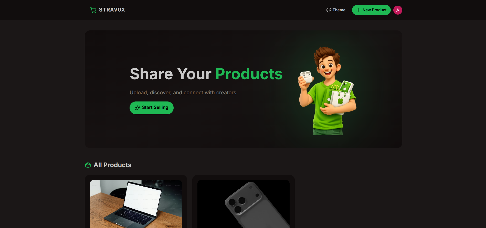
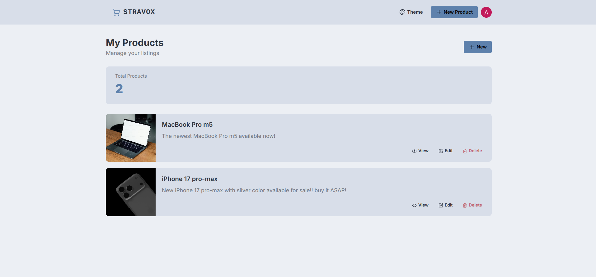

## Stravox

<table align="center"> 
    <tr> 
        <td align="center"> 
             
        </td> 
        <td align="center"> 
             
        </td> 
    </tr>
</table>

## 🚀 About The Project

Fully Responsive full stack amazon like project for selling and buying products this project is build using React.js, Type Script (For Backend), JavaScript (For Frontend), TailwindCSS, Node.js, Express, Clerk, Tanstack Query, Neon (PostgreSQL), and for icon lucide-react.

Now in this project I didn't added the payment methods this feature is up to you if you want to add it now you have your own choice which platform you want to use maybe 'stripe' I think it is the best one also 'lemon squeezy', and if for myself it is a practice project I want to make it even better using Next.js, Convex and other dependencies.

## 📦 Getting Started

1) Install Dependencies

Under both folder frontend and backend run:

2) npm install

Or even better in the root package.json file I've prepared the build for you so you can run:

3) npm run build

And for starting the backend and frontend at the same time under one url that is localhost:3000 you can run:

4) npm start

Keep in mind run `npm start` after you build the project using `npm run build`.

5) Good Luck!
